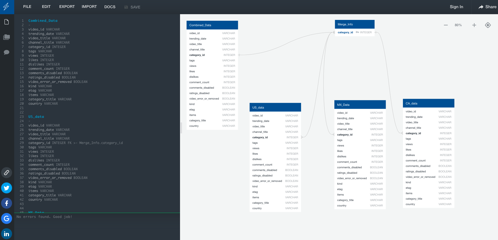
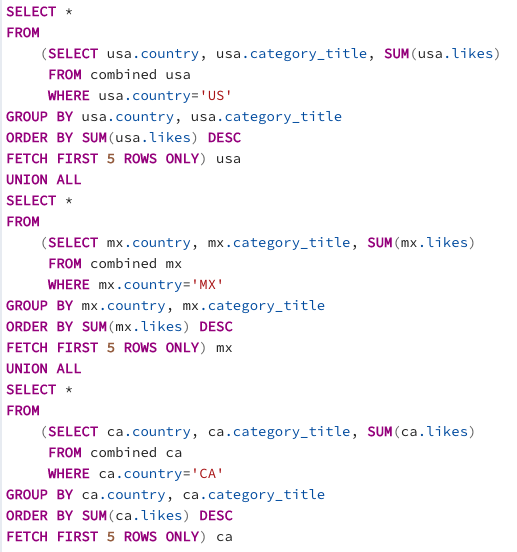
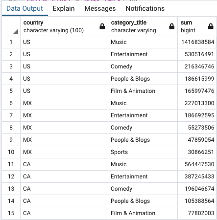
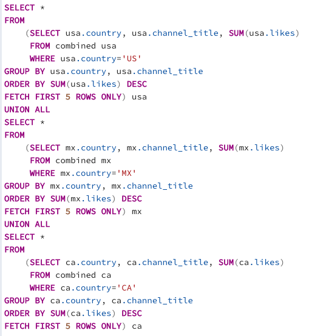
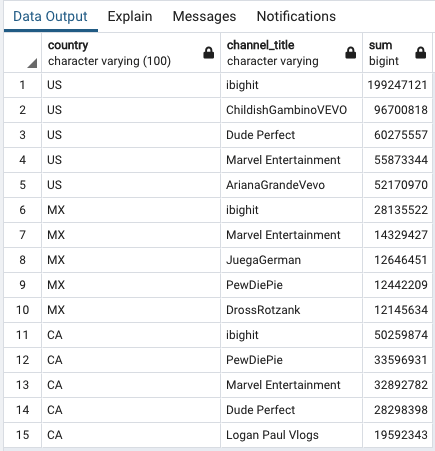
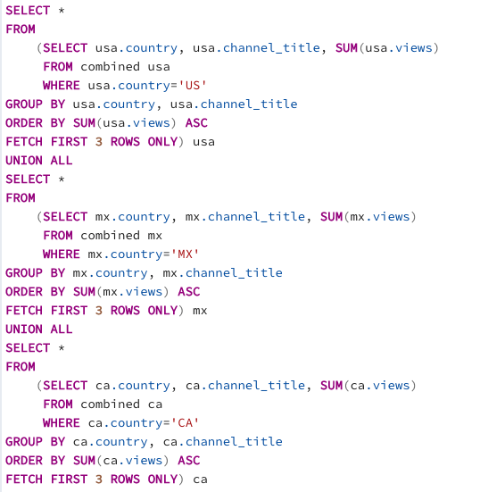
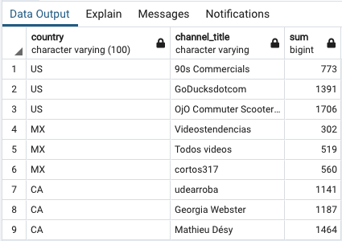

# **Project 2 - Extract, Transform, Load (ETL)**

In an effort to demonstrate our skills acquired thus far, in a real-world-esque scenario, we embarked on a project to extract data from sources, tranform it by cleaning and/or reformatting, and loading or storing the resulting data into a well designed database.  This is a key process for any company utilizing data to enhance decision-making.  This process of extraction, transformation, and loading is commonly referred to as "ETL".

## **Background**

YouTube is a popular platform for videos that people use for entertainment, education, workouts, and countless other reasons.  If a company is looking to market in North America and would like to understand trends in order to maximize their ad views, the database we developed could be helpful.

## **Table of Contents**

- [ETL Process](#etl-process)
    - [Step 1: Extract](#step-1-extract)
    - [Step 2: Transform](#step-2-transform)
    - [Step 3: Load](#step-3-load)
- [Schema](#schema)
- [Setup](#setup)
- [Sample Queries](#sample-queries)
- [Status](#status)
- [Team Members](#team-members)

## **ETL Process**

## Step 1: Extract

### YouTube Data Extraction
- Downloaded `.csv files` and `json files` from [Kaggle.com](https://www.kaggle.com/datasnaek/youtube-new)
- Reviewed the data sets available and narrowed in on the files for Canada (CA), Mexico (MX), and the United States (US) to focus on North America results in 2017 and 2018
- Read the `.csv file` and `json file` into Jupyter Notebook for cleaning and transformation 

## Step 2: Transform

### Cleaning and Error Removal
- After extracting the files, the team analyzed the dataframes to assess what information was relevant for  the final database
- The team decided to keep all of the variables except for the publish_time, thumbnail_link, and description
- Three dataframes were created for the 3 different countries (CA, MX, US) being analyzed
- Looping through the `json file` proved to be challenging and required the following additional steps to work through the error messages:
    - The team discovered that a regular store of the `json file` into a dataframe resulted in "missing" data
    - In order to obtain the data, an alternate approach was used to parse out the "missing", non-traversed elements into lists to append to the dataframe
- Merging the `.csv file` and `json file` also required some finesse:
    - In order to prevent issues/errors with nt64 when trying to merge on `category_id`, an integer conversion was made on the `id_list` in the `json file` dataframe
    - In preparation for the final merge, a country code was added to distinguish country of origin
    - title_x and title_y columns renamed as video title and category_title, data frame renamed as renamed_combined_USdata
    - title_x and title_y columns renamed as video title and category_title, data frame renamed as renamed_combined_MXdata
    - title_x and title_y columns renamed as video title and category_title, data frame renamed as renamed_combined_CAdata
    - new renamed_combined_USdata data, renamed_combined_MXdata, renamed_combined_CAdata frames saved as csv file in the resource folder.
    - pd.concat was used merge the three countries cleaned dataframes into one large combined dataframe
    - New merged_all data has 122281 rows × 18 columns named ‘video_id', 'trending_date', 'video_title', 'channel_title', 'category_id', 'tags', 'views', 'likes', 'dislikes', 'comment_count', 'comments_disabled', 'ratings_disabled', ’video_error_or_removed', 'kind', 'etag', 'items', 'category_title', 'country'.
    - Saved this merged_all dataframe as combined.csv file for team to use for SQL and ERD processes. 

## Step 3: Load

- Once the merged dataframe were properly formatted, cleaned and transformed, the combined countries `.csv file` was loaded into a SQL database via the following steps:
    - A database was created in pgAdmin4 called "youtube-trends"
    - A table called "combined" was created to correspond with the `.csv file` from the combined countries information
    - The `.csv file` was then imported into the SQL database
- When trying to import the `.csv file` the following error messge was received by the team: "ERROR: unterminated csv quoted field"
- The team took the following steps to navigate through the challenge:
    - Update the `trending_date` from DATE to VARCHAR to accomodate the atypical date entry style
    - Removed the character limitations that had been included for several of the fields with VARCHAR
    - Set the Escape criteria to "
    - Created a combined_id column header for the index
    
## **Schema**

## **Sample Queries**

In order to provide direction in regards to which categories and channels would be optimal for advertizing, the team ran several queries including:

- **Top categories in countries**

- **Top channels in countries**

- **Lowest views in countries**

**Top YouTube Channel ("ibighit") Video Example**

## **Status**

*This project is complete.*

## **Team Members**

- [Felicia Felix](https://github.com/Felicia620)
- [Peta-Gaye Lysius](https://github.com/petagaye2001)
- [Heather Mott](https://github.com/HeathMo)
- [Byron Pineda](https://github.com/byronpineda225)
- [Kate Yayla](https://github.com/Kate-Yayla)

